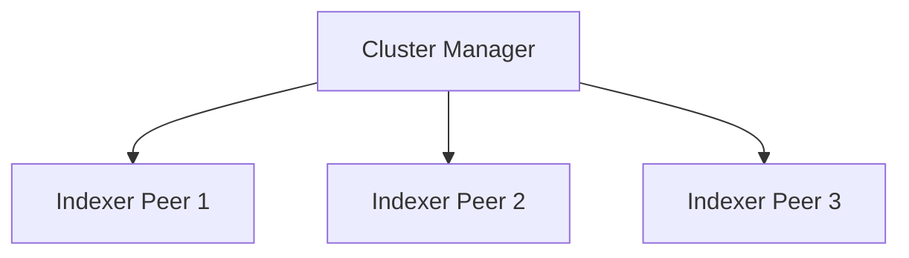

---

marp: true
theme: default
paginate: true
backgroundImage: url(img/background-std-header.png)

---
<!-- Global style -->
<style>
header {
  color: white;
  background-color: black;
  text-align: right;
  font-size: 30px;
  left: 450px;
  height: 50px;
  top: 10px;
  position: absolute;
  
}

img[alt~="center"] {
  display: block;
  margin: 0 auto;
}

h1 {
  text-align: right;
  font-size: 60px;
}

</style>
<!-- Global style -->

--- 

<!-- _header: 'Splunk Container Image' --> 

- [Docker Hub](https://hub.docker.com/r/splunk/splunk)

- [Github Repo](https://github.com/splunk/docker-splunk)

- [Deployment splunk-ansible](https://github.com/splunk/splunk-ansible)

- "Support": 
https://www.splunk.com/blog/2018/10/24/announcing-splunk-on-docker.html

---

<!-- _header: 'hello world' --> 

```bash
docker run splunk/splunk:latest

WARNING: No password ENV var.  Stack may fail to provision if splunk. \
password is not set in ENV or a default.yml\
License not accepted, please adjust SPLUNK_START_ARGS to indicate you \
have accepted the license.
The license you are accepting is the Splunk General Terms, available \
here: https://www.splunk.com/en_us/legal/splunk-general-terms.html
Unless you have jointly executed with Splunk a negotiated version of \
these General Terms that explicitly supersedes this agreement, by \
accessing or using Splunk software, you are agreeing to the Splunk \
General Terms.
Please read and make sure you agree to the Splunk General Terms before \
you access or use this software.
only once you've done so should you include the '--accept-license' \
flag to indicate your acceptance of the Splunk General Terms and \
launch this software.\

For example: docker run -e SPLUNK_START_ARGS=--accept-license -e SPLUNK_PASSWORD=Password01 splunk/splunk
```

---

<!-- _header: 'start me!' --> 

```bash
docker run -e SPLUNK_START_ARGS=--accept-license -e \
SPLUNK_PASSWORD=Password01 splunk/splunk
```

---

<!-- _header: 'vars vars vars!!' --> 


- https://splunk.github.io/splunk-ansible/ADVANCED.html#supported-environment-variables

--- 
<!-- _header: 'build index cluster' --> 

- SPLUNK_START_ARGS=--accept-license
- SPLUNK_PASSWORD=Password01
- SPLUNK_ROLE=splunk_cluster_master
- SPLUNK_INDEXER_URL=idx1,idx2,idx3
- SPLUNK_IDXC_SECRET=mypass4splunk



--- 


--- 


# Fragen? # 

